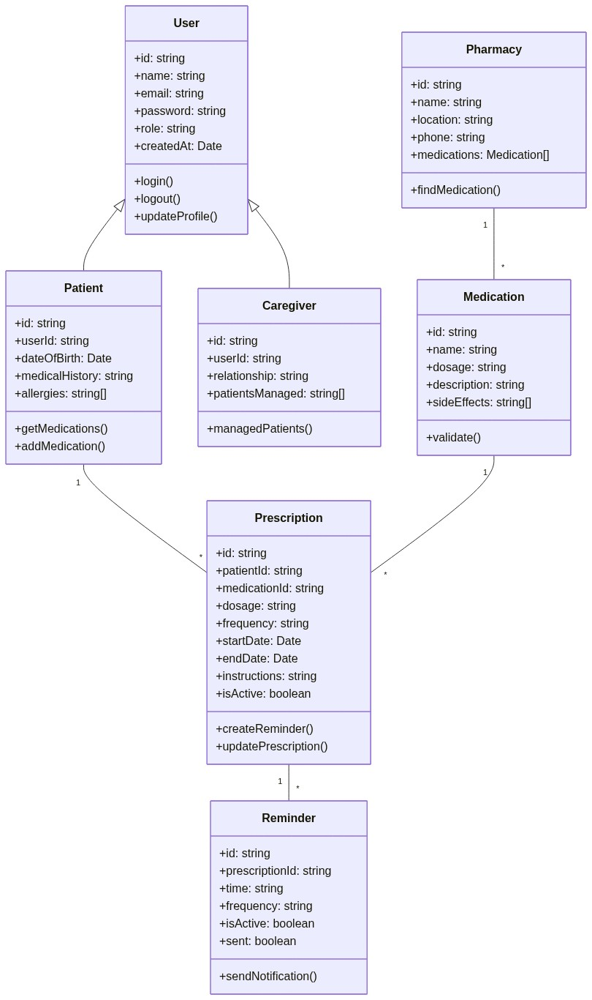
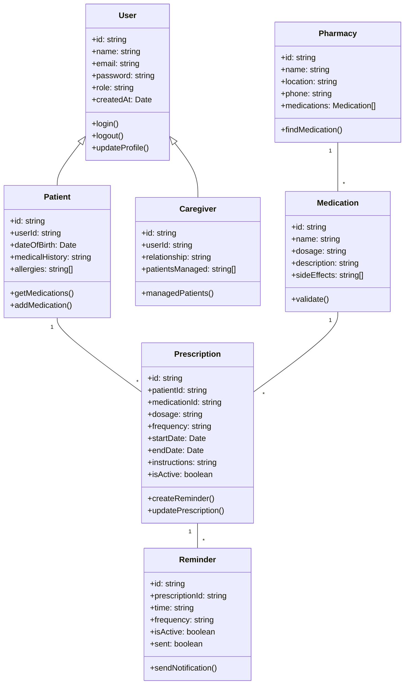

# Diagrama de Classes - NexDose

Representação das entidades principais do sistema e suas relações.

## 📊 Visualização

## 📝 Código Mermaid

## Descrição das Classes

| Classe | Responsabilidade |
|--------|------------------|
| **User** | Entidade base com autenticação e perfil |
| **Patient** | Paciente com histórico médico |
| **Caregiver** | Cuidador que gerencia pacientes |
| **Medication** | Medicamento com informações |
| **Prescription** | Prescrição vinculada a paciente e medicamento |
| **Reminder** | Lembrete de horários de medicação |
| **Pharmacy** | Farmácia com catálogo de medicamentos |
