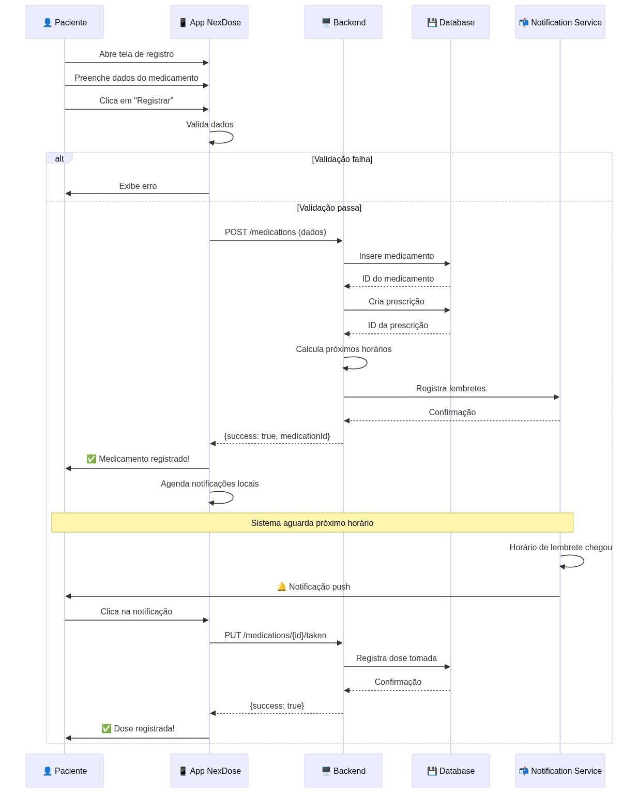
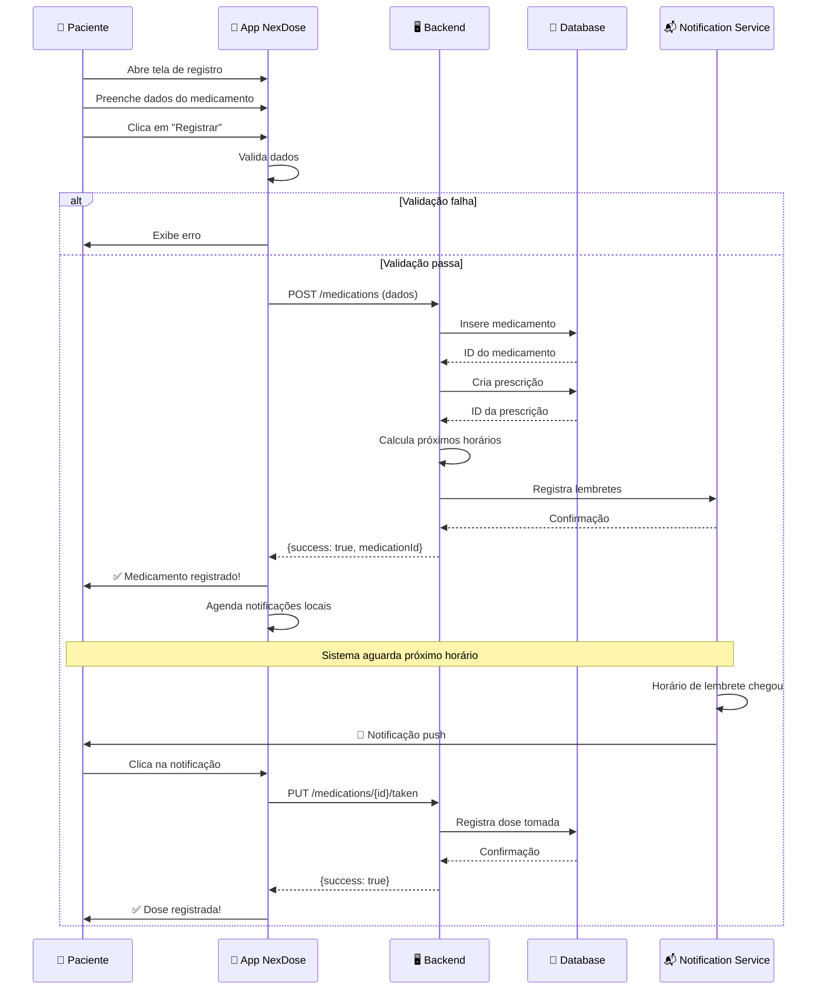

# Diagrama de Sequência - Fluxo de Registro e Lembretes

Representa o fluxo completo de registro de medicamento e funcionamento do sistema de lembretes.

## 📈 Visualização

## 📝 Código Mermaid

## Fluxos Descritos

### 1. Registro de Medicamento
1. Paciente abre a tela de registro (RegisterMedicationScreen)
2. Preenche os dados da medicação
3. Frontend valida os dados
4. Se válido, envia POST para o backend
5. Backend insere na database e cria prescrição
6. Calcula horários dos lembretes
7. Registra na notification service
8. Retorna sucesso ao app
9. App agenda notificações locais

### 2. Sistema de Lembretes
1. Notification Service aguarda o horário configurado
2. Quando chegar o horário, envia notificação push
3. Paciente clica na notificação
4. App registra a dose como tomada
5. Backend salva na database
6. Confirma ao paciente

## Estados Possíveis
- ✅ **Sucesso**: Medicamento registrado e lembretes ativados
- ❌ **Erro de Validação**: Dados inválidos, exibe mensagem
- ⏳ **Pendente**: Aguardando lembrete
- ✔️ **Tomado**: Dose registrada com sucesso
