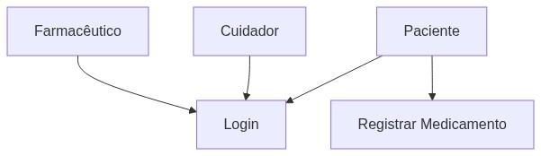
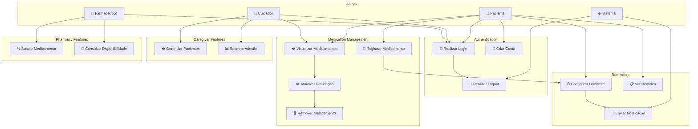

# Diagrama de Casos de Uso - NexDose

Funcionalidades do sistema por tipo de ator/usuário.

## 🎯 Visualização

## 📝 Código Mermaid

## Funções por Ator

### 👤 Paciente
- Criar conta e fazer login
- Registrar medicamentos
- Visualizar seus medicamentos
- Configurar lembretes
- Ver histórico de adesão

### 👥 Cuidador
- Gerenciar múltiplos pacientes
- Rastrear adesão ao tratamento
- Visualizar medicamentos dos pacientes
- Receber notificações de atualizações

### 💊 Farmacêutico
- Buscar medicamentos no catálogo
- Consultar disponibilidade
- Atualizar informações de medicamentos

### ⚙️ Sistema
- Enviar notificações de lembretes
- Registrar histórico de adesão
- Autenticar usuários
